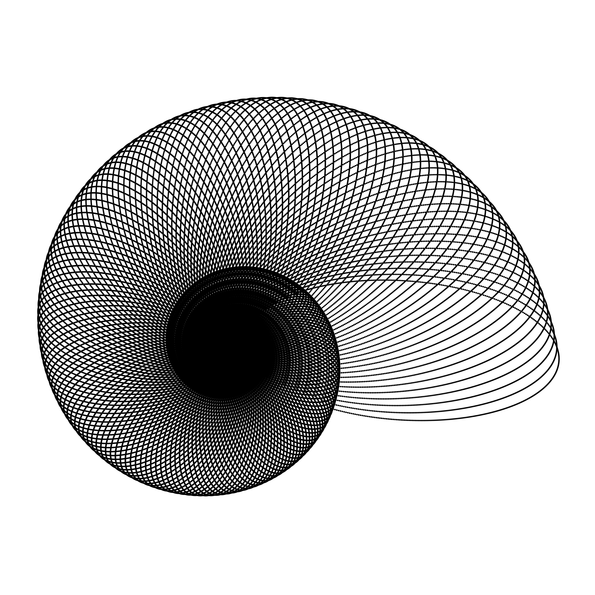
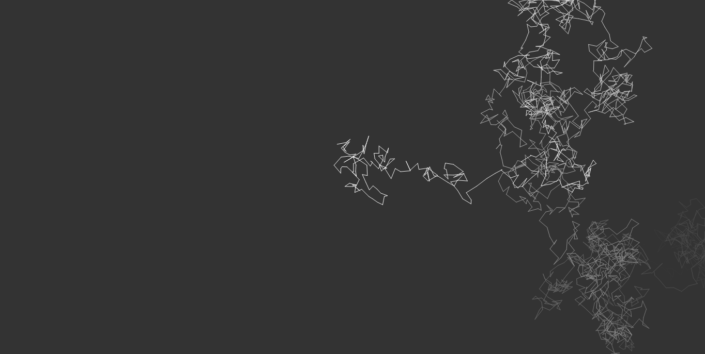
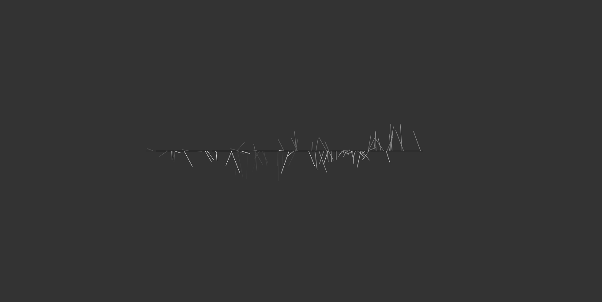

# Generative art @ undo.studio

A gallery of generative art, with the newest on top.

## shell

Mollusc shells in R using a [package by Marcus Volz](https://github.com/marcusvolz/mathart).

[View full gallery »](shell/README.md)

## scribble

Random lines drawn with p5.js. I started with the below example, and found that
by modifying only a few parameters the results are vastly different.

Original

One of the resulting creations

[View full gallery »](scribble/README.md)
