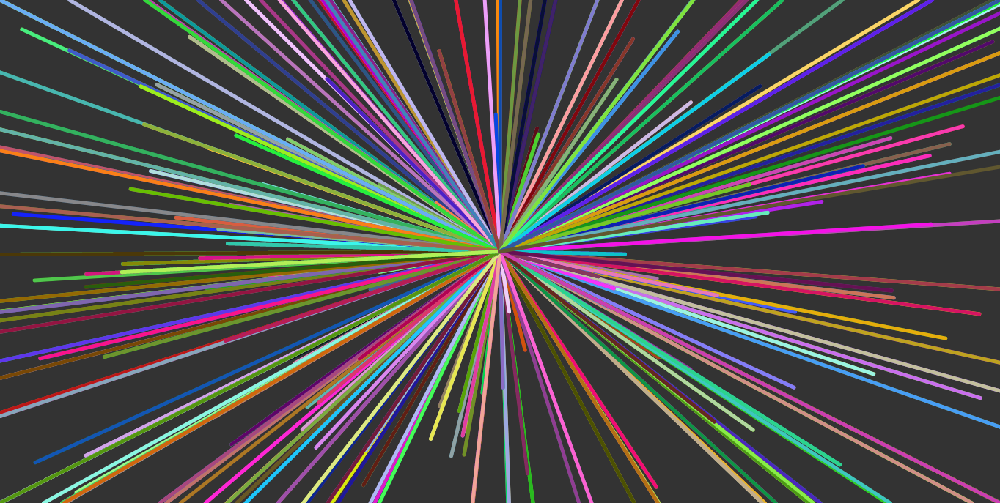

# generative-art

## scribble

Random lines drawn with p5.js. I started with the below example, and found that by modifying only a few parameters the results are vastly different.

Original

New creations. See [scribble/output](scribble/output) for all images.

