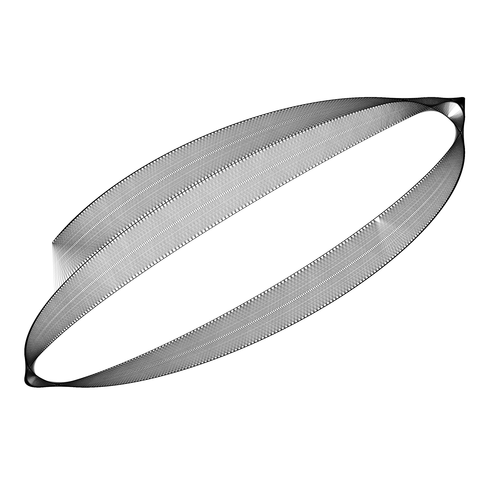

# Lissajous curves

> A Lissajous curve, also known as Lissajous figure or Bowditch curve, is the graph of a system of parametric equations which describe complex harmonic motion.
> <cite>[Wikipedia](https://en.wikipedia.org/wiki/Lissajous_curve)</cite>

## Run

```
cd lissajous
Rscript lissajous.r
```

## Gallery





