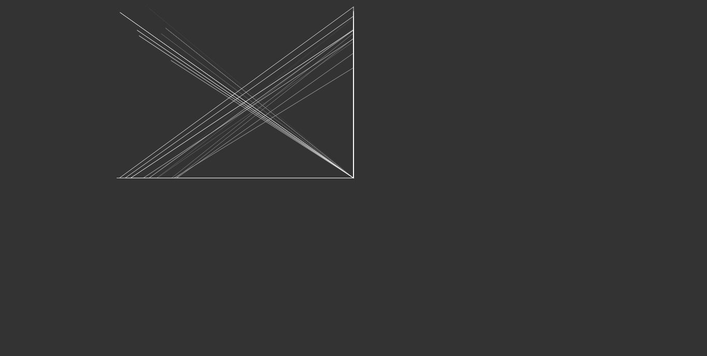
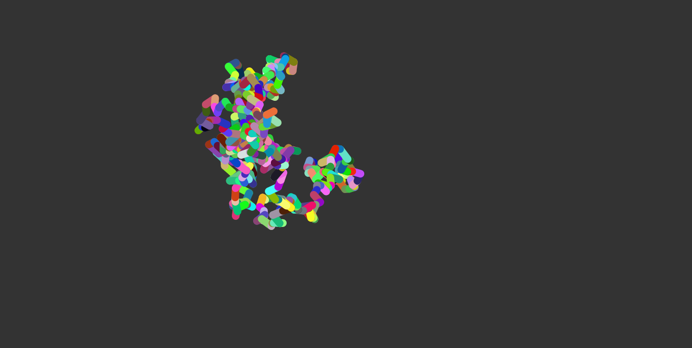
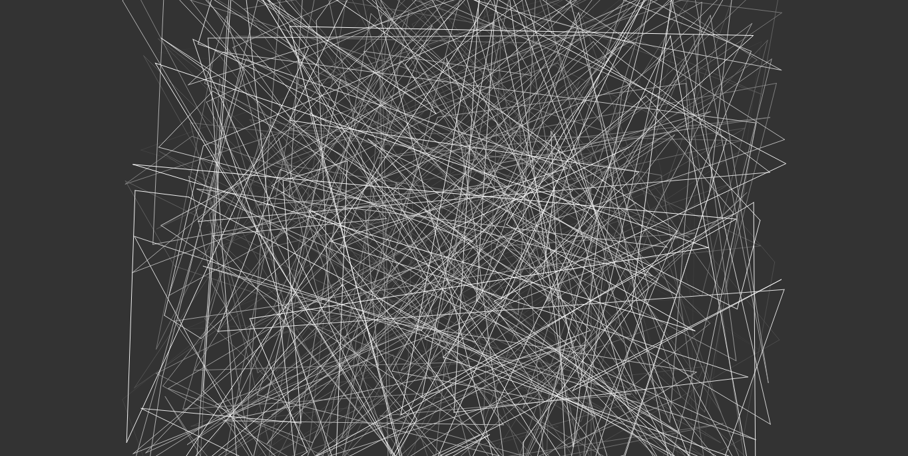
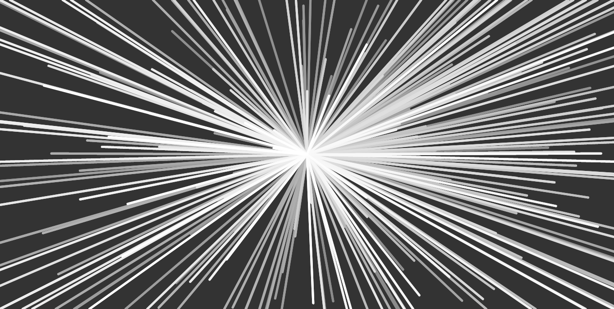
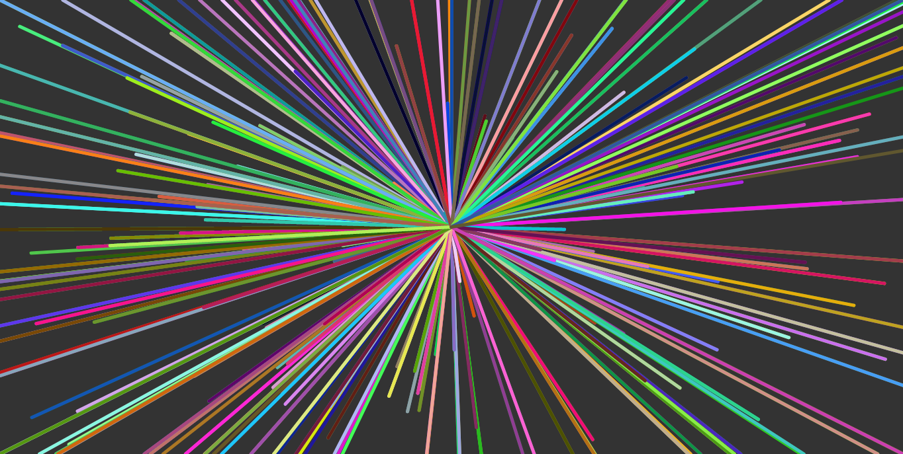

# scribble

Open the file `index.html` in a browser. For this first one I made the mistake
of not saving the parameters as I tried different things, so some parameters
will need to be tweaked to get some of the resulting images.

## Gallery

